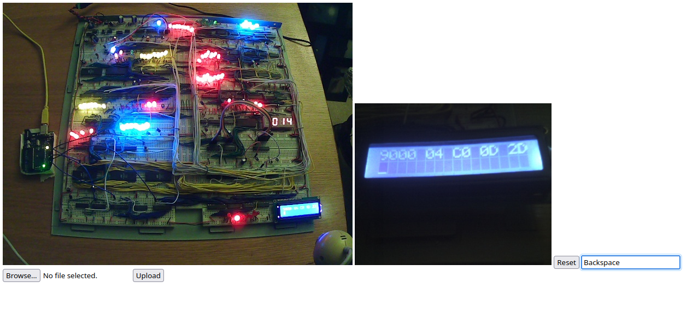

# Spdr Remote Control
This allows the spdr computer to be controled through a web interface.
An Arduino emulates a PS/2 keyboard and recieves characters to input
over serial. A server streams two cameras pointing at the computer
to a website on which a user can enter keys, reset the computer or
upload a file to be entered in hexidecimal.

